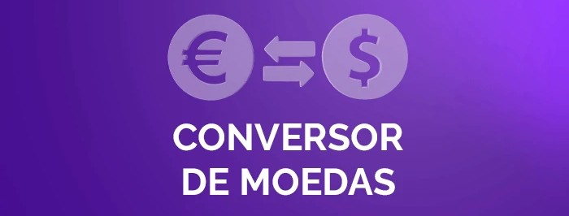

<div align="center">
    
</div>

# 🚀 Conversor de Moedas

Bem-vindo ao **Conversor de Moedas**! Este é um aplicativo de console desenvolvido em Java para realizar conversões monetárias em tempo real, utilizando uma API de taxas de câmbio externas.

---

### ✨ Funcionalidades Principais

* **Menu Interativo:** Interface simples e intuitiva no console.
* **Cotação em Tempo Real:** Garante que as taxas de conversão sejam atualizadas através de chamadas à API.
* **Seis Opções de Conversão:** Oferece os pares de moedas mais comuns do cenário brasileiro e latino-americano.
* **Fluxo de Trabalho:** Permite ao usuário continuar convertendo ou sair do programa após cada operação.

---

### ⚙️ Pré-requisitos

Para que o projeto funcione corretamente, você deve ter o seguinte ambiente configurado:

1.  **Java Development Kit (JDK):** Versão 11 ou superior.
2.  **IDE:** Recomenda-se o IntelliJ IDEA.
3.  **Biblioteca GSON:** O projeto exige a biblioteca **GSON** (Google Gson) para desserializar as respostas JSON da API.
4.  **Chave de API:** Uma chave de acesso válida da **ExchangeRate-API** ou serviço similar.

---

### 🔑 Configuração da API

Você deve **substituir** o placeholder da chave no arquivo `Principal.java` pela sua chave real antes de executar:

```java
private static final String API_KEY = "SUA_CHAVE_DE_API_AQUI";
```

### 🔒 Nota de Segurança Importante!

**Atenção:** Para fins de avaliação e demonstração de funcionalidade da Alura, a chave de API pode estar temporariamente inserida no código-fonte.

*Em um cenário real de desenvolvimento, esta chave seria removida e carregada de forma segura. (por exemplo, via variáveis de ambiente) antes de ser publicada em qualquer repositório público (como o GitHub).*

---

### 💡 Guia de Uso
Siga estes passos para executar e interagir com o conversor no seu console.

1. **Execução**
- Abra o projeto no seu IDE (IntelliJ IDEA).

- Verifique se a biblioteca GSON está corretamente incluída nas dependências do projeto.

- Execute o Principal.java.

2. **Interação com o Menu Principal**
Ao iniciar, você verá o menu de opções:
```
*************************************************
Seja Bem-vindo(a) ao Conversor de Moedas!
 
1) Dólar (USD) => Peso argentino (ARS)
2) Peso argentino (ARS) => Dólar (USD)
3) Dólar (USD) => Real brasileiro (BRL)
4) Real brasileiro (BRL) => Dólar (USD)
5) Dólar (USD) => Peso colombiano (COP)
6) Peso colombiano (COP) => Dólar (USD)
7) Sair
*************************************************
 
>>> Escolha uma opção válida: 
```
- 1 - Escolha a Conversão: Digite o número correspondente à conversão que deseja (de 1 a 6) e pressione Enter.

- 2 - Informe o Valor: O programa solicitará o valor numérico (ex: 150,75) que você deseja converter.

- 3 - Resultado: O resultado da conversão (obtido com a cotação em tempo real da API) será exibido.

3. **Menu Pós-Conversão**
Após cada resultado, você será questionado sobre o próximo passo:
```
*************************************************
O que você gostaria de fazer agora?

1) Voltar ao Menu Principal
2) Sair do Programa
*************************************************

>>> Escolha uma opção (1 ou 2): 
```
- *Opção 1:* O programa retorna ao menu principal para uma nova conversão.

- *Opção 2:* O programa encerra a execução.

----

### ⚠️ Tratamento de Erros
O programa inclui mecanismos de tratamento de exceções para garantir a estabilidade:

- **Entrada Inválida:** Se você digitar texto ou um número fora do intervalo do menu, o programa exibirá um erro e solicitará uma nova entrada.

- **Falha na API:** Se houver um erro de conexão ou se a chave de API for inválida, uma mensagem de erro será exibida, e o programa tentará voltar ao menu.
